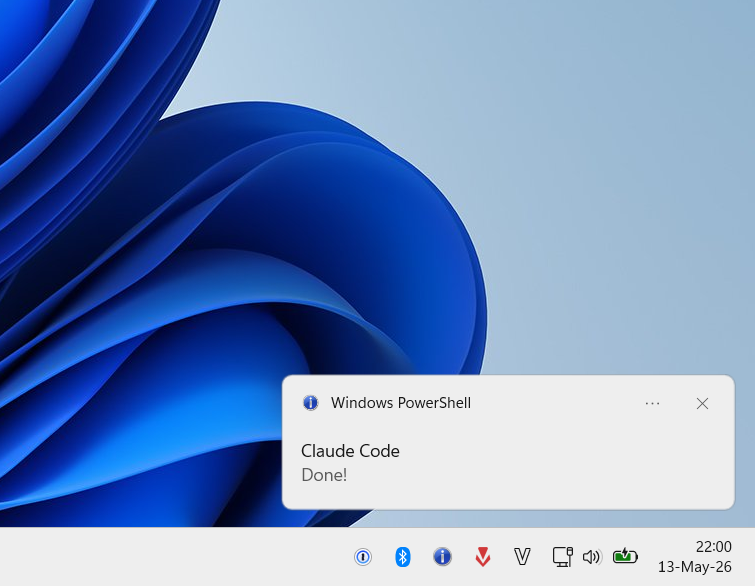

# Claude Code WSL2 Setup

Fixes for the most annoying Claude Code papercuts on WSL2 + Windows Terminal.

## Turn on LSP so Claude reads code like an IDE, not grep

Out of the box Claude Code falls back to text search when it needs to find a function or
trace a reference. That's why "find the auth handler" sometimes drifts into the wrong file.

LSP plugins ship with Claude Code since v2.0.74 — they wire Claude into the same language
servers VSCode uses for Go-to-Definition. Once the four official plugins are installed and
the binaries are on your PATH:

- `"add a stripe webhook to my payments page"` jumps straight to the existing payment module
- `"fix the auth bug on my dashboard"` follows the actual call hierarchy instead of guessing
- After every edit Claude picks up type errors immediately instead of finding them 10 prompts later

It also saves tokens, because Claude stops scrolling through files that don't match.

2-minute setup. TypeScript, Python, Go, Rust. **[→ LSP setup guide](lsp-setup.md)**

---

## Preview

<p align="center">
  <br>
  <em>Status line — project · context bar · 5h / weekly usage</em>
</p>

<p align="center">
  <br>
  <em>Balloon tip fires on <code>Stop</code> and <code>PermissionRequest</code>, skipped when Windows Terminal is focused</em>
</p>

## What it fixes

- **Image paste** — copy a screenshot on Windows and paste the file path straight into Claude Code or Codex. A small Go daemon ([wsl-screenshot-cli](https://github.com/Nailuu/wsl-screenshot-cli)) polls the Windows clipboard, saves new screenshots under `/tmp/.wsl-screenshot-cli/`, and rewrites the clipboard so paste returns the WSL path.
- **Shift+Enter newline** — insert a newline without submitting, in both the VSCode integrated terminal and Windows Terminal.
- **"Needs your input" Windows notification** — fires when Claude finishes a task or asks for permission, and is suppressed automatically when Windows Terminal is already focused. WSL2 variant uses a balloon tip; the native PowerShell variant uses a modern Windows toast.
- **Status line** — project directory, git branch, context-window fill bar, and 5-hour / 7-day usage, color-coded by severity.
- **Settings tweaks** — disable the `Co-authored-by: Claude` git attribution and pre-accept the project trust dialog.
- **Windows browser** — open links and OAuth flows in your existing Windows browser instead of Chromium inside WSL2.
- **Voice mode** — fix ALSA errors so `/voice` works, routing audio through WSLg's PulseAudio server.

## Setup

```bash
git clone https://github.com/congmnguyen/claude-code-wsl2-setup.git
cd claude-code-wsl2-setup
claude
```

Then prompt:

> Set this up

Claude will read the docs and configure everything.

## What's included

| File | Fix |
|------|-----|
| [`lsp-setup.md`](lsp-setup.md) | **LSP** — official plugins + language servers for TypeScript, Python, Go, Rust |
| [`image-paste.md`](image-paste.md) | Screenshot paste — wsl-screenshot-cli daemon + optional Alt+V keybinding |
| [`shift-enter.md`](shift-enter.md) | Shift+Enter newline in VSCode terminal and Windows Terminal |
| [`claude-notify.md`](claude-notify.md) | Windows balloon tip — WSL2 variant for Claude Code `Stop` / `PermissionRequest` hooks and Codex `notify` |
| [`claude-notify-powershell.md`](claude-notify-powershell.md) + [`claude-hook-toast.ps1`](claude-hook-toast.ps1) | Windows toast — native PowerShell variant |
| [`statusline.md`](statusline.md) | Status line — project dir, git branch, context bar, 5h / 7d usage |
| [`settings.md`](settings.md) | Disable git attribution, skip trust dialog |
| [`browser.md`](browser.md) | Open links in your Windows browser via `BROWSER` env var |
| [`mcp-setup.md`](mcp-setup.md) | DeepWiki, Playwright, and Figma Desktop MCP servers |
| [`voice.md`](voice.md) | Voice mode — ALSA → PulseAudio → WSLg bridge, `~/.asoundrc` + `PULSE_SERVER` |

## Custom agents and skills

| Path | Contents |
|------|----------|
| [`agents/`](agents/) | `code-architect`, `code-simplifier` |
| [`skills/`](skills/) | `commit-push-pr`, `dedupe`, `frontend-design`, `handoff`, `oncall-triage`, `spec` |
| [`codex-skills/`](codex-skills/) | Codex-native versions: `code-review`, `commit-push-pr`, `dedupe`, `frontend-design`, `handoff`, `oncall-triage`, `spec` |

Copy [`agents/`](agents/) and [`skills/`](skills/) to `~/.claude/agents/` and `~/.claude/skills/` for Claude Code. Copy [`codex-skills/`](codex-skills/) to `~/.codex/skills/` for Codex.

## Recommended third-party skills

Skills not authored here but worth installing alongside the setup:

- **[liteparse](https://github.com/run-llama/liteparse)** (LlamaIndex, MIT) — parse PDF, DOCX, PPTX, XLSX, and images locally with no cloud calls. Useful for feeding unstructured documents into Claude or Codex without uploading them. Install the npm package globally and copy the upstream `SKILL.md` into `~/.claude/skills/liteparse/`:

  ```bash
  npm i -g @llamaindex/liteparse
  sudo apt-get install -y libreoffice   # required for DOCX/PPTX/XLSX
  ```

## License

[MIT](LICENSE) — feel free to copy, fork, or adapt for your own setup.
