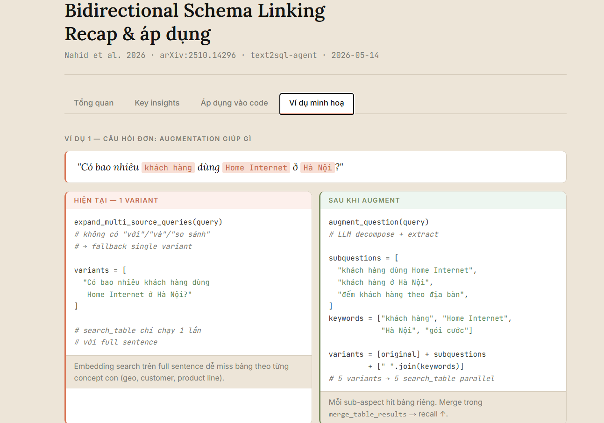

# Claude Code WSL2 Setup

Fixes for the most annoying Claude Code papercuts on WSL2 + Windows Terminal.

Most of these (image paste, notifications, CapsLock→Esc, voice) bridge WSL2 to the Windows
host and are WSL-specific. But the LSP, statusline, MCP, and Playwright CLI guides are plain
Claude Code config — they work on any Linux or macOS too.

## Turn on LSP so Claude reads code like an IDE, not grep

Out of the box Claude Code falls back to text search when it needs to find a function or
trace a reference. That's why "find the auth handler" sometimes drifts into the wrong file.

LSP plugins ship with Claude Code since v2.0.74 — they wire Claude into the same language
servers VSCode uses for Go-to-Definition. Once the four official plugins are installed and
the binaries are on your PATH:

- `"add a stripe webhook to my payments page"` jumps straight to the existing payment module
- `"fix the auth bug on my dashboard"` follows the actual call hierarchy instead of guessing
- After every edit Claude picks up type errors immediately instead of finding them 10 prompts later

It also saves tokens, because Claude stops scrolling through files that don't match.

2-minute setup. TypeScript, Python, Go, Rust. **[→ LSP setup guide](lsp-setup.md)**

---

## Featured fixes

Start with these — they are the highest-leverage pieces in the repo:

- **[LSP setup](lsp-setup.md)** — lets Claude use real Go-to-Definition / reference
  navigation instead of burning tokens on broad file search.
- **[Codex delegate](codex-delegate.md)** — routes large mechanical implementation to Codex
  through an isolated Sonnet wrapper, keeping the premium Claude orchestrator context clean.
- **[Image paste](image-paste.md)** — paste a Windows screenshot into Claude Code or Codex as
  a usable WSL file path.
- **[Notifications](claude-notify.md)** — get a Windows notification when Claude finishes or
  needs permission, without interrupting you while Windows Terminal is focused.
- **[Secrets hygiene hook](secrets-hygiene-hook.md)** — blocks credential-file reads before
  secrets can land in the transcript.
- **[Bash output truncation hook](truncate-bash-output.md)** — trims huge command output to
  head+tail so one verbose test/build log does not bloat the rest of the context.

---

## Preview

<p align="center">
  <br>
  <em>video-site | main | [████░░░░░░] 42% | 5h:28% | W:4%</em>
</p>

<p align="center">
  <br>
  <em>Codex delegate: let a premium Claude model orchestrate while Codex burns the implementation tokens in isolated subagents</em>
</p>

<p align="center">
  <br>
  <em>Balloon tip fires on <code>Stop</code> and <code>PermissionRequest</code>, skipped when Windows Terminal is focused</em>
</p>

<p align="center">
  <br>
  <em>Birchline HTML skill — single-file document-style artifacts with tabs, cards, and before/after panels</em>
</p>

## What it fixes

- **Image paste** — copy a screenshot on Windows and paste the file path straight into Claude Code or Codex. A small Go daemon ([wsl-screenshot-cli](https://github.com/Nailuu/wsl-screenshot-cli)) polls the Windows clipboard, saves new screenshots under `/tmp/.wsl-screenshot-cli/`, and rewrites the clipboard so paste returns the WSL path.
- **Shift+Enter newline** — insert a newline without submitting, in both the VSCode integrated terminal and Windows Terminal.
- **CapsLock → Escape** — remap CapsLock to Escape system-wide via SharpKeys (registry-level, works in WSL2, Vim, games, and elevated processes).
- **"Needs your input" Windows notification** — fires when Claude finishes a task or asks for permission, and is suppressed automatically when Windows Terminal is already focused. WSL2 variant uses a balloon tip; the native PowerShell variant uses a modern Windows toast.
- **Status line** — project directory, git branch, context-window fill bar, and 5-hour / 7-day usage, color-coded by severity.
- **Secrets hygiene hook** — blocks Claude from reading credential files into the transcript with `Read`, `Grep`, or content-printing shell commands.
- **Bash output truncation hook** — cuts huge command output (test runs, build logs, JSON dumps) down to head+tail with an omission marker, so one verbose command doesn't eat the context window for the rest of the session.
- **Settings tweaks** — disable the `Co-authored-by: Claude` git attribution and pre-accept the project trust dialog.
- **Windows browser** — open links and OAuth flows in your existing Windows browser instead of Chromium inside WSL2.
- **Voice mode** — fix ALSA errors so `/voice` works, routing audio through WSLg's PulseAudio server.

## Setup

```bash
git clone https://github.com/congmnguyen/claude-code-wsl2-setup.git
cd claude-code-wsl2-setup
claude
```

Then prompt:

> Set this up

Claude will read the docs and configure everything.

## What's included

### Claude Code core

| File | Fix |
|------|-----|
| [`lsp-setup.md`](lsp-setup.md) | Official LSP plugins + language servers for TypeScript, Python, Go, Rust |
| [`statusline.md`](statusline.md) | Project dir, git branch, context bar, 5h / 7d usage |
| [`settings.md`](settings.md) | Disable git attribution, skip trust dialog |

### Agent workflows

| File | Fix |
|------|-----|
| [`codex-delegate.md`](codex-delegate.md) | Codex delegation with token isolation via a Sonnet wrapper instead of direct MCP/plugin foreground output |
| [`mcp-setup.md`](mcp-setup.md) | DeepWiki, Playwright, and Figma Desktop MCP servers |
| [`playwright-cli.md`](playwright-cli.md) | Token-efficient browser automation; preferred over Playwright MCP for coding agents |

### Safety and context hygiene

| File | Fix |
|------|-----|
| [`secrets-hygiene-hook.md`](secrets-hygiene-hook.md) + [`hooks/block-secret-reads.sh`](hooks/block-secret-reads.sh) | PreToolUse hook — block credential-file reads before they hit the transcript |
| [`truncate-bash-output.md`](truncate-bash-output.md) + [`hooks/truncate-bash-output.sh`](hooks/truncate-bash-output.sh) | PostToolUse hook — truncate huge Bash output to head+tail before it eats context |

### WSL / Windows bridge

| File | Fix |
|------|-----|
| [`image-paste.md`](image-paste.md) | Screenshot paste — wsl-screenshot-cli daemon + optional Alt+V keybinding |
| [`claude-notify.md`](claude-notify.md) | Windows balloon tip — WSL2 variant for Claude Code `Stop` / `PermissionRequest` hooks and Codex `notify` |
| [`claude-notify-powershell.md`](claude-notify-powershell.md) + [`claude-hook-toast.ps1`](claude-hook-toast.ps1) | Windows toast — native PowerShell variant |
| [`shift-enter.md`](shift-enter.md) | Shift+Enter newline in VSCode terminal and Windows Terminal |
| [`browser.md`](browser.md) | Open links in your Windows browser via `BROWSER` env var |
| [`voice.md`](voice.md) | ALSA → PulseAudio → WSLg bridge, `~/.asoundrc` + `PULSE_SERVER` |
| [`capslock-esc.md`](capslock-esc.md) | CapsLock → Escape registry remap via SharpKeys |

## Custom agents and skills

| Path | Contents |
|------|----------|
| [`agents/`](agents/) | `code-architect`, `code-simplifier`, `codex-delegate` |
| [`skills/`](skills/) | `birchline-html`, `codex-delegate`, `commit-push-pr`, `dedupe`, `deep-teach`, `frontend-design`, `handoff`, `oncall-triage`, `pytorch-training`, `spec` |
| [`hooks/`](hooks/) | `block-secret-reads.sh` PreToolUse hook, `truncate-bash-output.sh` PostToolUse hook |
| [`scripts/`](scripts/) | `codex-run.sh` wrapper used by the `codex-delegate` Claude agent |
| [`codex-skills/`](codex-skills/) | Codex-native versions: `code-review`, `commit-push-pr`, `dedupe`, `frontend-design`, `handoff`, `oncall-triage`, `spec` |

Copy [`agents/`](agents/), [`skills/`](skills/), [`hooks/`](hooks/), and [`scripts/`](scripts/) to `~/.claude/agents/`, `~/.claude/skills/`, `~/.claude/hooks/`, and `~/.claude/scripts/` for Claude Code. Copy [`codex-skills/`](codex-skills/) to `~/.codex/skills/` for Codex.

## Recommended third-party skills

Skills not authored here but worth installing alongside the setup:

- **[liteparse](https://github.com/run-llama/liteparse)** (LlamaIndex, MIT) — parse PDF, DOCX, PPTX, XLSX, and images locally with no cloud calls. Useful for feeding unstructured documents into Claude or Codex without uploading them. Try it in the browser first: [simonw.github.io/liteparse](https://simonw.github.io/liteparse/). Then install the npm package globally and copy the upstream `SKILL.md` into `~/.claude/skills/liteparse/`:

  ```bash
  npm i -g @llamaindex/liteparse
  sudo apt-get install -y libreoffice   # required for DOCX/PPTX/XLSX
  ```

## License

[MIT](LICENSE) — feel free to copy, fork, or adapt for your own setup.
