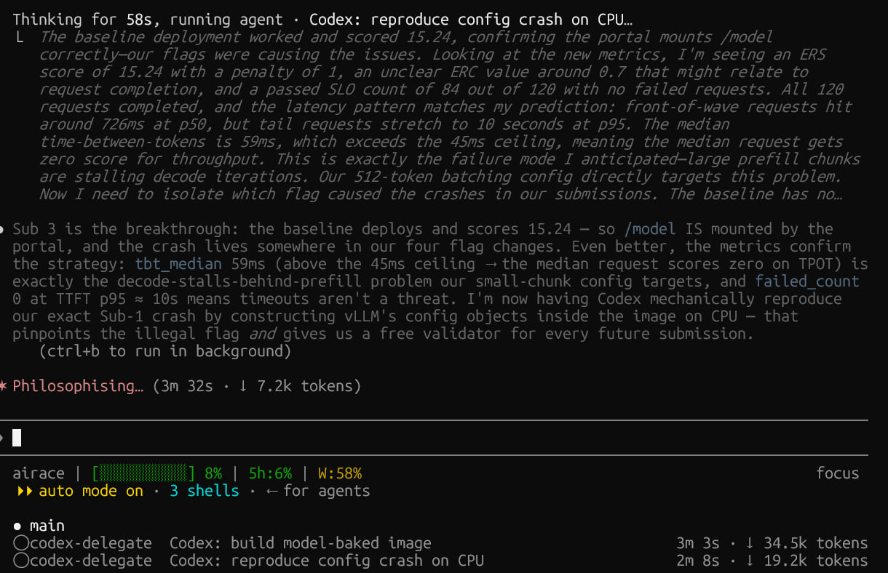
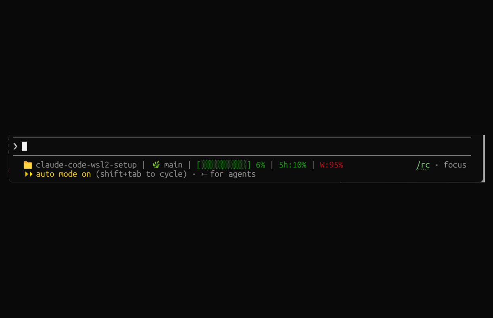
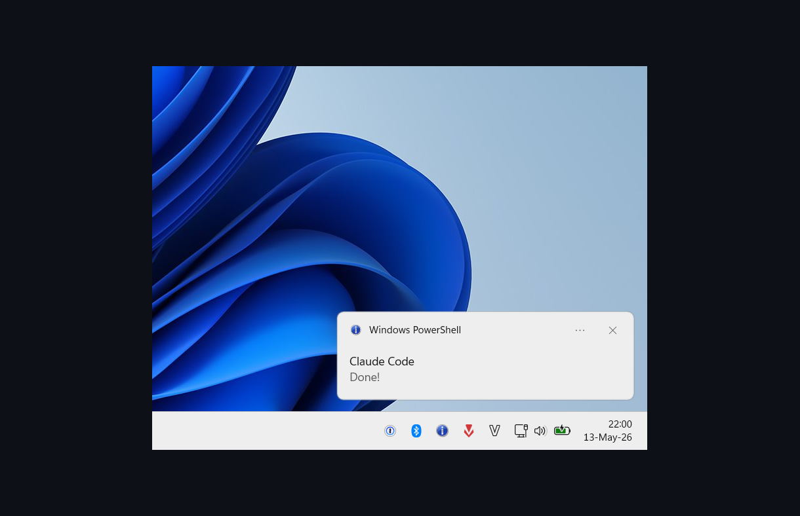
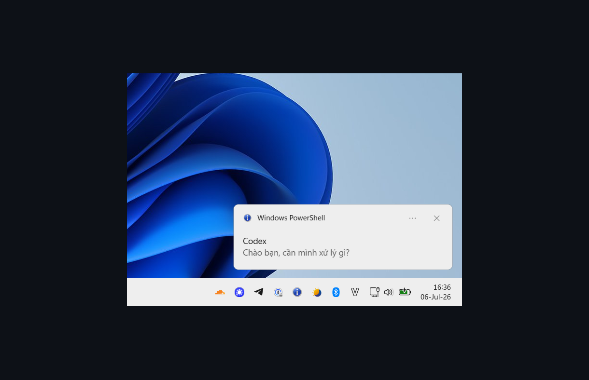
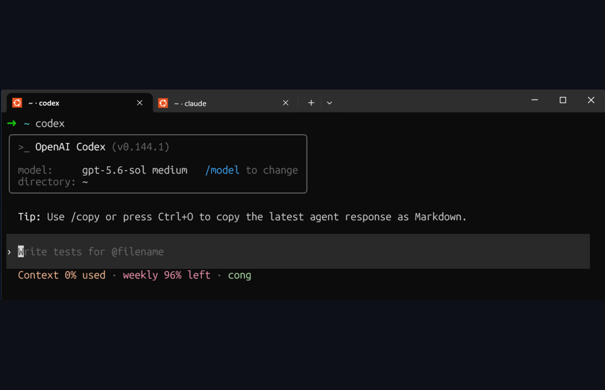

# Claude Code WSL2 Setup

My active Claude Code setup for WSL2 + Windows Terminal, built around one idea:
keep Claude focused on orchestration and hand implementation churn to Codex.

The repo only tracks the pieces I actually use: Codex delegation, LangSmith tracing,
LSP navigation, screenshot paste, Windows notifications, statusline, and token/context
hygiene hooks.

## Who this is for

Use this if you run Claude Code from WSL2 and want the Windows side to stop feeling
bolted on: screenshots paste as WSL paths, notifications land in Windows, browser
links open in your normal browser, and long implementation loops can move to Codex
without filling Claude's main conversation.

Where to start, depending on what hurts most:

- **Context burn** → [`codex-delegate`](codex-delegate.md), then [`lsp-setup`](lsp-setup.md)
  and [`truncate-bash-output`](truncate-bash-output.md).
- **Windows/WSL friction** → [`image-paste`](image-paste.md) and [`claude-notify`](claude-notify.md).
- **No visibility into what Claude did** → [`langsmith-tracing`](langsmith-tracing.md)
  and [`statusline`](statusline.md).

## Delegate implementation without filling Claude's main context

Large implementation tasks are expensive twice: Claude spends tokens doing the work, then
keeps every file read, edit, test run, and retry in the main conversation. That history
competes with the architecture and product context Claude needs to orchestrate well.

[`codex-delegate`](codex-delegate.md) sends a well-specified implementation task to Codex
through an isolated Claude subagent. Codex does the read/edit/test loop; the main session gets
back a short result and keeps its context for planning, steering, and review.

In the real run below, two Codex delegates handled tens of thousands of worker tokens in
parallel while the main Claude session still showed 8% context and 6% five-hour usage.

<p align="center">
  <br>
  <em>Codex does the implementation; the main Claude context receives only a compact summary.</em>
</p>

**[Set up Codex delegation →](codex-delegate.md)**

---

## Preview

<p align="center">
  <br>
  <em>claude-code-wsl2-setup | main | [░░░░░░░░░░] 6% | 5h:10% | W:95%</em>
</p>

<p align="center">
  <br>
  <em>Balloon tip fires on Claude Code <code>Notification</code> events, skipped when Windows Terminal is focused</em>
</p>

<p align="center">
  <br>
  <em>Codex's top-level <code>notify</code> command shows the completed turn's last reply</em>
</p>

<p align="center">
  <br>
  <em>Shell-managed titles keep Claude Code and Codex tabs distinguishable.</em>
</p>

## Setup

```bash
git clone https://github.com/congmnguyen/claude-code-wsl2-setup.git
cd claude-code-wsl2-setup
claude
```

Then prompt:

> Set this up

Claude will read the docs and configure everything.

For a manual install, copy the relevant files from [`agents/`](agents/), [`skills/`](skills/),
[`hooks/`](hooks/), and [`scripts/`](scripts/) into the matching `~/.claude/` directories,
then read the linked setup page for the feature you want.

## What's included

### Claude Code core

| File | Fix |
|------|-----|
| [`lsp-setup.md`](lsp-setup.md) | Official LSP plugins + language servers for TypeScript, Python, Go, and Rust, so Claude uses real Go-to-Definition / find-references instead of burning tokens on broad file search |
| [`statusline.md`](statusline.md) | Project dir, git branch, context-window fill bar, and 5-hour / 7-day usage, color-coded by severity |
| [`langsmith-tracing.md`](langsmith-tracing.md) | Project-level LangSmith traces for turns, tool calls, subagent runs, and compaction events — without enabling telemetry for every local session |
| [`settings.md`](settings.md) | Disable the `Co-authored-by: Claude` git attribution and pre-accept the project trust dialog |

### Agent workflows

| File | Fix |
|------|-----|
| [`codex-delegate.md`](codex-delegate.md) | Codex delegation with token isolation via a low-effort Sonnet wrapper instead of direct MCP/plugin foreground output |
| [`mcp-setup.md`](mcp-setup.md) | DeepWiki MCP; Figma Desktop is project-specific |
| [`playwright-cli.md`](playwright-cli.md) | Token-efficient browser automation; preferred over Playwright MCP for coding agents |

### Safety and context hygiene

| File | Fix |
|------|-----|
| [`secrets-hygiene-hook.md`](secrets-hygiene-hook.md) + [`hooks/block-secret-reads.sh`](hooks/block-secret-reads.sh) | PreToolUse hook — blocks credential-file reads via `Read`, `Grep`, or content-printing shell commands before secrets reach the transcript |
| [`truncate-bash-output.md`](truncate-bash-output.md) + [`hooks/truncate-bash-output.sh`](hooks/truncate-bash-output.sh) | PostToolUse hook — trims huge output (test runs, build logs, JSON dumps) to head+tail with an omission marker, so one verbose command doesn't eat the rest of the context window |
| [`format-python-with-ruff.md`](format-python-with-ruff.md) + [`hooks/format-python-with-ruff.sh`](hooks/format-python-with-ruff.sh) | PostToolUse hook — auto-formats Python edits with Ruff, only in projects that declare Ruff config |

### WSL / Windows bridge

| File | Fix |
|------|-----|
| [`image-paste.md`](image-paste.md) | Copy a screenshot on Windows, paste the file path straight into Claude Code or Codex. A systemd user service keeps [wsl-screenshot-cli](https://github.com/Nailuu/wsl-screenshot-cli) running, saves shots under `/tmp/.wsl-screenshot-cli/`, and restarts the monitor if it exits. Optional Alt+V keybinding |
| [`terminal-title.md`](terminal-title.md) | Distinct zsh tab titles for the current project and active agent, such as `text2sql-agent · ✳ Claude` or `text2sql-agent · >_ Codex` |
| [`claude-notify.md`](claude-notify.md) | Windows balloon tip on Claude Code `Notification` events — Claude finished, needs permission, or a background agent completed — suppressed when Windows Terminal is already focused |
| [`codex-notify.md`](codex-notify.md) | Reuse the same balloon script through Codex's top-level `notify` command |
| [`bin/tmux-notify-run`](bin/tmux-notify-run) | Detached tmux jobs with logs, exit status, and Windows completion notification |
| [`shift-enter.md`](shift-enter.md) | Shift+Enter inserts a newline instead of submitting, in both the VSCode integrated terminal and Windows Terminal |
| [`browser.md`](browser.md) | Open links and OAuth flows in your Windows browser via `BROWSER`, plus an XDG fallback for OAuth CLIs |
| [`capslock-esc.md`](capslock-esc.md) | CapsLock → Escape via a SharpKeys registry remap — works in WSL2, Vim, games, and elevated processes |

## Custom agents and skills

| Path | Contents |
|------|----------|
| [`agents/`](agents/) | `code-architect`, `codex-delegate` |
| [`skills/`](skills/) | Active local skills: `codex-delegate`, `commit-push-pr`, `deep-teach`, `pytorch-training` |
| [`hooks/`](hooks/) | `block-secret-reads.sh` PreToolUse hook; `truncate-bash-output.sh` and `format-python-with-ruff.sh` PostToolUse hooks |
| [`scripts/`](scripts/) | `codex-run.sh` wrapper used by the `codex-delegate` Claude agent |

Copy the matching files to `~/.claude/agents/`, `~/.claude/skills/`, `~/.claude/hooks/`,
and `~/.claude/scripts/`.

After adding or updating a skill, run `/reload-skills` to make it available without
restarting the session. Custom agents still require a restart.

Codex skills and the rest of my Codex setup live in the companion repo
[`congmnguyen/codex-wsl2-setup`](https://github.com/congmnguyen/codex-wsl2-setup).

## Troubleshooting

If a hook, plugin, or other customization breaks Claude Code, start a clean diagnostic
session with `claude --safe-mode`. Use `/doctor`, `/hooks`, and `/mcp` to inspect the
installation and loaded integrations.

## Pruned notes

Native Windows PowerShell notifications, WSLg voice-mode audio, and uninstalled Claude
skills were removed from the main repo because they are not part of the active local setup.

## Recommended third-party skills

Skills not authored here but worth installing alongside the setup:

- **[liteparse](https://github.com/run-llama/liteparse)** (LlamaIndex, MIT) — parse PDF, DOCX, PPTX, XLSX, and images locally with no cloud calls. Useful for feeding unstructured documents into Claude or Codex without uploading them. Try it in the browser first: [simonw.github.io/liteparse](https://simonw.github.io/liteparse/). Then install the npm package globally and copy the upstream `SKILL.md` into `~/.claude/skills/liteparse/`:

  ```bash
  npm i -g @llamaindex/liteparse
  sudo apt-get install -y libreoffice   # required for DOCX/PPTX/XLSX
  ```

## License

[MIT](LICENSE) — feel free to copy, fork, or adapt for your own setup.
