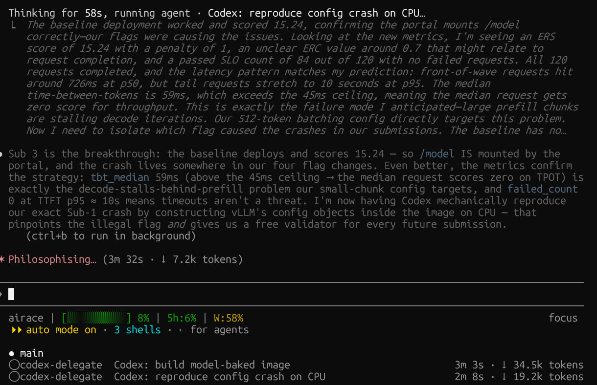

# Delegate implementation to Codex — the token-cheap way

## Problem

You want your Claude Code orchestrator (Opus, Fable, …) to hand heavy or mechanical coding
off to Codex (`gpt-5.5`), so the big generation work runs on OpenAI's quota instead of your
Claude usage. The obvious ways backfire:

- **`claude mcp add codex -- codex mcp-server`** (Codex as an MCP tool), or the
  [`openai/codex-plugin-cc`](https://github.com/openai/codex-plugin-cc) plugin in its default
  foreground mode: convenient, but Codex's **entire transcript flows back into the main
  context**. You pay premium orchestrator tokens to read it — the opposite of saving tokens.
- **Calling `codex exec` directly from the main session**: same problem — stdout lands in
  your orchestrator context.

A quick benchmark (one well-specified `duration.py` task, graded by a hidden test suite)
made the gap concrete:

| Method | Codex tokens | Chars dumped into main context | Tests |
|--------|-------------:|-------------------------------:|:-----:|
| Orchestrator does it itself | 0 | ~1.3 KB (the code) | 43/43 |
| Codex → straight into main context (= MCP add) | 60k | **~91 KB** | 43/43 |
| Codex inside a cheap Sonnet subagent | 47k | **~0.2 KB** (summary only) | 43/43 |

Same correctness all three ways. The only thing that changes is how much of Codex's
transcript your expensive orchestrator has to swallow. The subagent wrapper is the only
option that actually keeps it out.

<p align="center">
  <br>
  <em>A real large task: the main Fable/Opus-style orchestrator stays focused, Codex burns
  the implementation tokens in delegate subagents, and the 5-hour Claude usage moves only a
  few percent.</em>
</p>

## Why not just use MCP or the plugin?

Because this repo is optimizing for **orchestrator context**, not just "can Claude call
Codex?"

MCP and `codex-plugin-cc` are great convenience layers. If you want a simple button that
lets Claude ask Codex for help, use them. This repo solves the sharper problem Theo-style
power users run into: premium Claude models are good orchestrators, but they should not be
the place where a 90 KB implementation transcript lands.

The self-written wrapper exists for four concrete reasons:

- **Token isolation** — Codex's long transcript is absorbed by a cheaper Sonnet wrapper
  subagent; Opus/Fable only sees the final summary.
- **Predictable contract** — the orchestrator gets the same small report every time:
  files changed, tests, wall-clock, Codex tokens, and failure mode.
- **Safety rails** — Codex is only invoked through `scripts/codex-run.sh`, which uses a
  prompt file, writes logs outside the main transcript, refuses flag pass-through, and
  detects quota/stall cases.
- **Review gate** — Codex implements, but Claude still reviews the diff before accepting.
  The workflow is route → execute → verify, not "trust another agent blindly."

So this is not a replacement for the official transports. It is the opinionated version for
people who care about keeping the expensive orchestrator clean while still using Codex for
large mechanical implementation.

## How it works

A thin **Sonnet subagent** is the wrapper. The orchestrator writes a self-contained spec,
spawns the subagent, and the subagent:

1. Runs `codex exec -s workspace-write --skip-git-repo-check "<spec>"` via Bash.
2. Absorbs Codex's full transcript (tens of KB) into **its own** cheap context.
3. Returns a ~10-line summary: files changed, codex tokens, wall-clock, test result.

The orchestrator only ever sees the summary. The heavy generation runs on OpenAI; the heavy
transcript sits in a Sonnet subagent, not your Opus/Fable context.

> **This does not make delegation free against your Claude usage.** The Sonnet subagent
> still spends Claude tokens (~35k in the benchmark) to read the transcript — that counts
> against your plan, it's just the cheaper tier instead of premium orchestrator tokens. The
> genuinely-offloaded part is Codex's ~50k tokens, which run on OpenAI. Net: a clear win on
> **large** tasks, a **loss** on small ones (the wrapper overhead exceeds the work).

## Setup

Copy the agent, skill, and wrapper script into your Claude config:

```bash
mkdir -p ~/.claude/agents ~/.claude/skills ~/.claude/scripts
cp agents/codex-delegate.md          ~/.claude/agents/
cp -r skills/codex-delegate          ~/.claude/skills/
cp scripts/codex-run.sh              ~/.claude/scripts/
chmod +x ~/.claude/scripts/codex-run.sh
```

Requires the [Codex CLI](https://github.com/openai/codex) installed and authenticated
(`codex --version`, `codex login`). Codex's default model lives in `~/.codex/config.toml`
(set `model = "gpt-5.5"`).

**Trap — restart after adding the agent.** Custom agents in `~/.claude/agents/` load only at
Claude Code startup, so a freshly-copied `codex-delegate` agent isn't callable until you
restart. Skills *do* hot-load, so the skill ships a fallback that spawns a generic Sonnet
subagent pointed at the same playbook file — it works before the restart too.

### Turn fallback into routing (optional)

Add this to `~/.claude/CLAUDE.md` so the orchestrator delegates *proactively* instead of
waiting to be asked each time:

```markdown
## Delegating implementation to Codex (gpt-5.5)

The `codex-delegate` skill/agent runs `codex exec` through `~/.claude/scripts/codex-run.sh`
inside a cheap Sonnet subagent and returns only a summary — the token-cheap way to offload
work off the main orchestrator context. Route by task type; don't wait to be asked:

- Delegate for large, well-specified work: multi-file refactor, migration, boilerplate,
  bulk-mechanical edits, clear-spec implementation that would cost many round-trips inline.
- Do it yourself for: small one-shot edits, architecture judgment about this codebase, and
  user-facing work where taste matters.
- Never call `codex exec` directly from the main context (it dumps the whole transcript).
  Always go through the subagent/script; the script refuses extra flags and detects quota/stalls.
- After Codex returns, `git diff`/review before accepting — you own the merge.
```

## Result

Say *"delegate this to codex"* (or let the routing rule fire on a matching task). The
orchestrator writes a spec, a Sonnet subagent drives Codex in the background, and you get
back a short summary while your main context stays lean. Then review the diff yourself
before merging.

## When to use it

- **Use** for large, well-specified, mechanical work — the kind that would otherwise flood
  your context with dozens of Read/Edit/test/fix round-trips.
- **Don't use** for small one-shot edits (delegation overhead beats the work), or anything
  needing deep judgment about *your* codebase — Codex comes in cold with no memory of the
  conversation, so it can produce technically-correct-but-off-convention code.
- Delegation buys **speed and token routing, not quality**. Output quality only improves if
  you add a review gate (orchestrator reviews Codex's diff) or the task fits `gpt-5.5`'s
  strengths — not because Codex is universally better.

## Safety

- `workspace-write` lets Codex edit **any file under the working directory**, including
  `.env` or config/DB files. For a sensitive repo, pass a narrower `WORKDIR` or use
  `read-only`.
- The subagent never uses approval-bypass flags (`-c approval_policy=never`,
  `--dangerously-bypass-*`) — those get blocked by the safety classifier anyway. It relies on
  the sandbox, where writes under the working directory need no approval.
