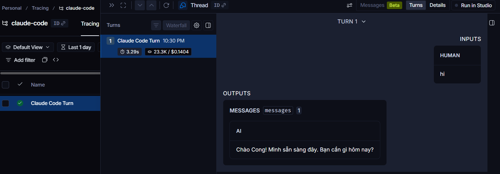

# Claude Code — LangSmith Tracing

Trace selected Claude Code projects to LangSmith without turning every local session into
telemetry.

<p align="center">
  <br>
  <em>A Claude Code turn traced into LangSmith with messages, timing, tokens, and cost.</em>
</p>

## What this captures

The `langsmith-tracing` plugin records Claude Code turns, tool calls, subagent runs,
compaction events, and assistant responses. System prompts are not included, but normal
messages, tool inputs, and tool outputs can still contain private code or secrets.

Use it for projects where trace review is valuable, not as a blanket default.

## Install the plugin globally

Install the marketplace and plugin at user scope:

```text
/plugin marketplace add langchain-ai/langsmith-claude-code-plugins
/plugin install langsmith-tracing@langsmith-claude-code-plugins
/reload-plugins
```

Or from the shell:

```bash
claude plugin marketplace add langchain-ai/langsmith-claude-code-plugins --scope user
claude plugin install langsmith-tracing@langsmith-claude-code-plugins --scope user
```

Verify:

```bash
claude plugin list | rg langsmith-tracing
```

The plugin can stay global. The trace environment should not.

## Enable tracing per project

Create or edit `.claude/settings.local.json` inside the project you want to trace:

```json
{
  "env": {
    "TRACE_TO_LANGSMITH": "true",
    "CC_LANGSMITH_API_KEY": "<LangSmith API key>",
    "CC_LANGSMITH_PROJECT": "text2sql-agent"
  }
}
```

Use a project name that matches the repo, for example:

| Repo | `CC_LANGSMITH_PROJECT` |
|------|-------------------------|
| `/home/cong/code/text2sql-agent` | `text2sql-agent` |
| `/home/cong/code/claude-code-wsl2-setup` | `claude-code-wsl2-setup` |
| `/home/cong/code/airace` | `airace` |

Restart Claude Code or run `/reload-plugins`.

## Keep the key local

Do not put `TRACE_TO_LANGSMITH`, `CC_LANGSMITH_API_KEY`, or `CC_LANGSMITH_PROJECT` in
global `~/.claude/settings.json` unless you intentionally want every Claude Code session
to trace.

Check that the local settings file is ignored before adding a real key:

```bash
git check-ignore -v .claude/settings.local.json
```

If it is not ignored, add this to `.gitignore` first:

```gitignore
.claude/settings.local.json
```

If a LangSmith API key is ever pasted into chat, logs, or a committed file, revoke it and
create a new one. Treat transcripts as permanent exposure.

## Quick checks

```bash
jq empty .claude/settings.local.json
claude plugin list | rg langsmith-tracing
```

After a Claude Code response completes, open LangSmith and check the matching project. If
you interrupt a run, the plugin may flush the partial trace on the next message or at
session end.
