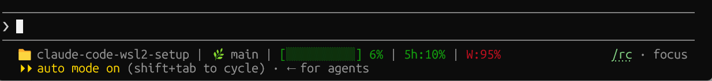

# Claude Code Status Line

A custom status line script that shows the current project directory, git branch, context window usage, and rate limits — color-coded by severity.



```
📁 video-site | 🌿 main | [████░░░░░░] 42% | 5h:28% | W:4%
```

- **Project dir** — basename of `.workspace.current_dir` (fallback: `$PWD`), prefixed with `📁`
- **Git branch** — current branch, prefixed with `🌿` (only shown inside git repos)
- **Progress bar** — context window fill (green < 70%, yellow < 90%, red ≥ 90%)
- **5h:X%** — 5-hour rolling usage
- **W:X%** — 7-day rolling usage

---

## Install

**1. Save the script**

```bash
cat > ~/.claude/statusline-command.sh << 'EOF'
#!/usr/bin/env bash
# Claude Code status line
# Format: 📁 video-site | 🌿 branch | [████░░░░░░] 42% | 5h:28% | W:4%

input=$(cat)

IFS=$'\t' read -r cwd ctx_pct five_pct week_pct < <(
  printf '%s' "$input" | jq -r '[
    .workspace.current_dir // .cwd // "",
    .context_window.used_percentage // "",
    .rate_limits.five_hour.used_percentage // "",
    .rate_limits.seven_day.used_percentage // ""
  ] | @tsv'
)

parts=()

# ── Helper: pick ANSI color based on percentage ───────────────────────────────
pct_color() {
  local pct=$1
  if   [ "$pct" -lt 70 ]; then printf '\033[32m'
  elif [ "$pct" -lt 90 ]; then printf '\033[33m'
  else                          printf '\033[31m'
  fi
}

# ── 0. Project dir basename ───────────────────────────────────────────────────
project_dir="${cwd:-$PWD}"
project_name="$(basename "$project_dir")"
parts+=("📁 $project_name")

# ── 1. Git branch (only inside git repos) ─────────────────────────────────────
if [ -n "$cwd" ]; then
  branch=$(git -C "$cwd" --no-optional-locks symbolic-ref --short HEAD 2>/dev/null)
  [ -n "$branch" ] && parts+=("🌿 $branch")
fi

# ── 2. Context window progress bar + percentage ───────────────────────────────
if [ -n "$ctx_pct" ]; then
  pct=$(printf '%.0f' "$ctx_pct")
  color=$(pct_color "$pct")
  filled=$(( pct * 10 / 100 ))
  [ "$filled" -gt 10 ] && filled=10
  empty=$(( 10 - filled ))
  bar=""
  for (( i=0; i<filled; i++ )); do bar="${bar}█"; done
  for (( i=0; i<empty;  i++ )); do bar="${bar}░"; done
  parts+=("$(printf "${color}[%s] %d%%\033[0m" "$bar" "$pct")")
fi

# ── 3. 5-hour usage ───────────────────────────────────────────────────────────
if [ -n "$five_pct" ]; then
  pct=$(printf '%.0f' "$five_pct")
  color=$(pct_color "$pct")
  parts+=("$(printf "${color}5h:%d%%\033[0m" "$pct")")
fi

# ── 4. Weekly usage ───────────────────────────────────────────────────────────
if [ -n "$week_pct" ]; then
  pct=$(printf '%.0f' "$week_pct")
  color=$(pct_color "$pct")
  parts+=("$(printf "${color}W:%d%%\033[0m" "$pct")")
fi

# ── Join with " | " and print ─────────────────────────────────────────────────
out=""
for part in "${parts[@]}"; do
  [ -z "$out" ] && out="$part" || out="${out} | ${part}"
done

printf '%b\n' "$out"
EOF
chmod +x ~/.claude/statusline-command.sh
```

**2. Wire it into `~/.claude/settings.json`**

```json
{
  "statusLine": {
    "type": "command",
    "command": "bash ~/.claude/statusline-command.sh"
  }
}
```

Restart Claude Code. The status line appears at the bottom of the interface.

---

## How it works

Claude Code pipes a JSON blob to the script's stdin on every refresh. The script extracts four fields in one `jq` call:

| Field | JSON path |
|-------|-----------|
| Working dir | `.workspace.current_dir` |
| Context % | `.context_window.used_percentage` |
| 5-hour usage % | `.rate_limits.five_hour.used_percentage` |
| 7-day usage % | `.rate_limits.seven_day.used_percentage` |

The git branch is resolved by running `git symbolic-ref` against the working directory from the JSON — no `cd` needed, and `--no-optional-locks` avoids touching `.git/` lock files.

---

## Debugging

Use a wrapper script to capture the live JSON without breaking the statusline:

```bash
cat > /tmp/debug-statusline.sh << 'EOF'
#!/usr/bin/env bash
input=$(cat)
printf '%s' "$input" | jq '.' > /tmp/statusline-debug.json
printf '%s' "$input" | bash ~/.claude/statusline-command.sh
EOF
chmod +x /tmp/debug-statusline.sh
```

Temporarily swap in `~/.claude/settings.json`:

```json
{
  "statusLine": {
    "type": "command",
    "command": "bash /tmp/debug-statusline.sh"
  }
}
```

Restart Claude Code, then inspect:

```bash
cat /tmp/statusline-debug.json | jq '{five_hour: .rate_limits.five_hour, seven_day: .rate_limits.seven_day}'
```

Test the script offline against a saved snapshot:

```bash
cat /tmp/statusline-debug.json | bash ~/.claude/statusline-command.sh
```
